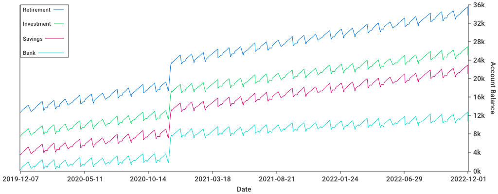

# munn

CLI tool to project financial portfolio value.

Output is formatted with tabs to easily paste into Excel:

```bash
λ munn example.yaml | grep -v ^Applied | tail
2022-11-24      Investment      40.00
2022-11-24      Retirement      3550.00
2022-12-01      Bank    63555.12
2022-12-01      Savings 3530.00
2022-12-01      Investment      40.00
2022-12-01      Retirement      3550.00
2022-12-02      Bank    61362.28
2022-12-02      Savings 3530.00
2022-12-02      Investment      40.00
2022-12-02      Retirement      3550.00
```

You can also generate a graph image:
```bash
λ munn --image example.yaml
```
